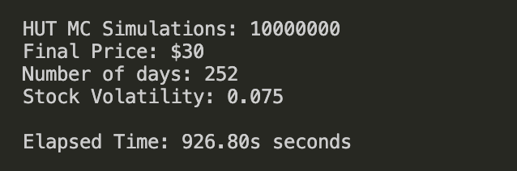
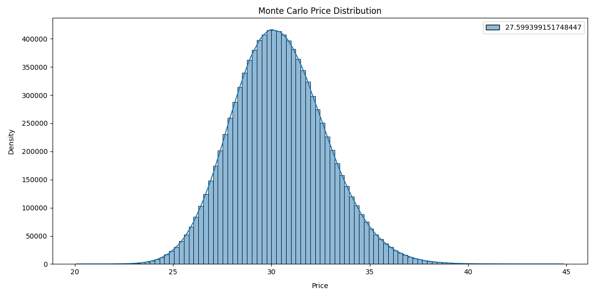

# A Monte Carlo Simulation For Stocks

## Languages Used

 

## App objectives

- get user stock ticker input
- fetch ALL stock historical prices
- calculate price volatility 
- Use rust to generate sims based on stock historical prices
- tally avg final price for all sims
- use python to plot results

 

## Setup

- Inside root directory cd into `scripts` to fetch stock's historical prices, run `python3 get_data.py`
- enter the stock ticker you want to get prices for
- a csv output file will be created inside the `src` directory containing the prices.
- python will also print the `initial price` and `volatility`
- update `main.rs` variables line 70 - 75 
- now run monte carlo engine (mc) 
- `cargo build`
- after your rust app finishes building, run your app `cargo run`
- the rust app will ask for the stock ticker, initial price, and volatility, number of days to speculate (252 trading days per year)
- after entering these inputs the mc engine will and run print results

 

## Plot results

- inside `scripts` directory, run `python3 plot.py` to see the price distribution histogram from all the simulations.

 

## Upcoming implementation

- automate the workflow with one command
- find way to make python execute rust code
- try new rust web framework to run client

 

 

## Demo

### Monte Carlo results

<i>results of a 10 Million simulation for HUT stock price</i>

 

 

### Price Distribution from Simulations

 

